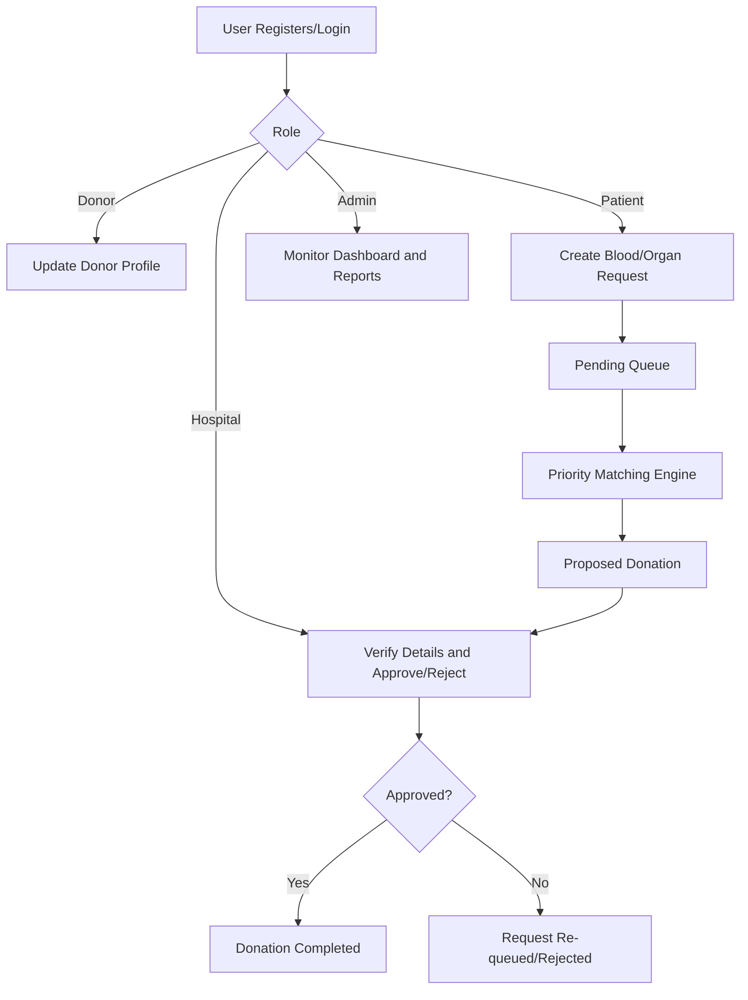
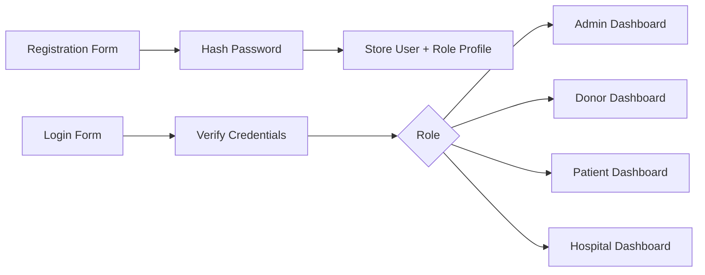
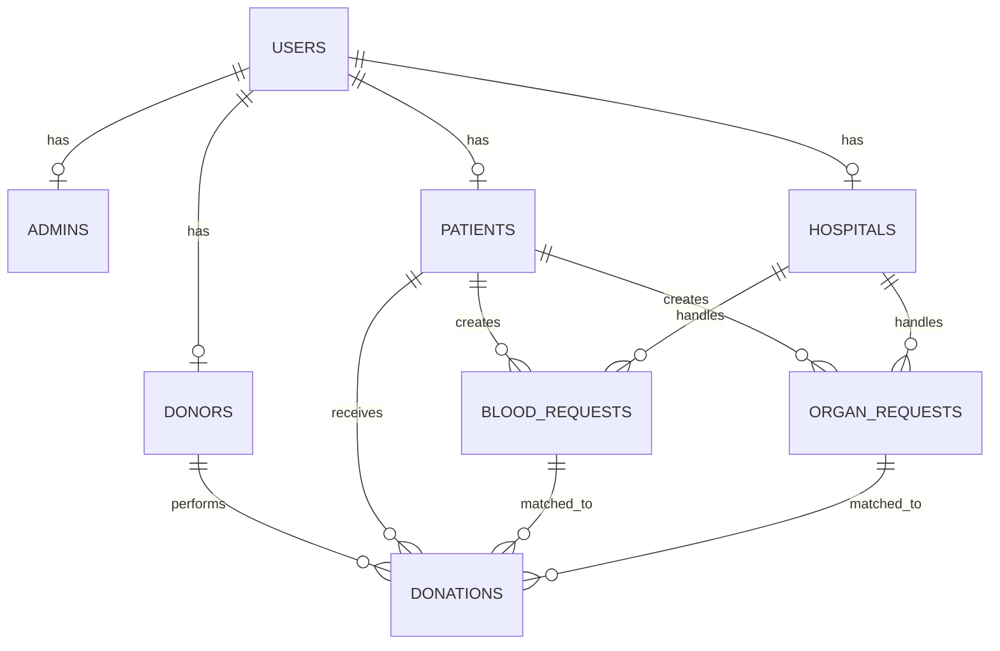
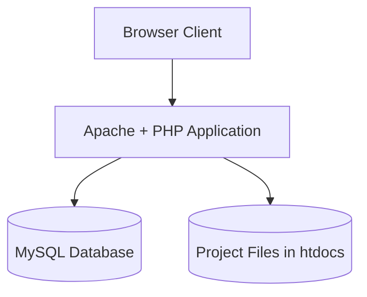

# Flowcharts and System Diagrams

## A. Overall Request Flowchart

```mermaid
flowchart TD
    A[User Registers/Login] --> B{Role}
    B -->|Donor| C[Update Donor Profile]
    B -->|Patient| D[Create Blood/Organ Request]
    B -->|Hospital| E[Verify Details and Approve/Reject]
    B -->|Admin| F[Monitor Dashboard and Reports]
    D --> G[Pending Queue]
    G --> H[Priority Matching Engine]
    H --> I[Proposed Donation]
    I --> E
    E --> J{Approved?}
    J -->|Yes| K[Donation Completed]
    J -->|No| L[Request Re-queued/Rejected]
```

## B. Authentication Flowchart

```mermaid
flowchart LR
    A[Registration Form] --> B[Hash Password]
    B --> C[Store User + Role Profile]
    D[Login Form] --> E[Verify Credentials]
    E --> F{Role}
    F --> G[Admin Dashboard]
    F --> H[Donor Dashboard]
    F --> I[Patient Dashboard]
    F --> J[Hospital Dashboard]
```

## C. Entity Relationship Diagram (Simplified)

```mermaid
erDiagram
    USERS ||--o| ADMINS : has
    USERS ||--o| DONORS : has
    USERS ||--o| PATIENTS : has
    USERS ||--o| HOSPITALS : has

    PATIENTS ||--o{ BLOOD_REQUESTS : creates
    PATIENTS ||--o{ ORGAN_REQUESTS : creates
    DONORS ||--o{ DONATIONS : performs
    PATIENTS ||--o{ DONATIONS : receives
    BLOOD_REQUESTS ||--o{ DONATIONS : matched_to
    ORGAN_REQUESTS ||--o{ DONATIONS : matched_to
    HOSPITALS ||--o{ BLOOD_REQUESTS : handles
    HOSPITALS ||--o{ ORGAN_REQUESTS : handles
```

## D. Deployment Diagram

```mermaid
flowchart TB
    U[Browser Client] --> W[Apache + PHP Application]
    W --> DB[(MySQL Database)]
    W --> FS[(Project Files in htdocs)]
```
